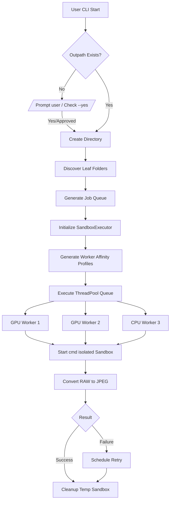

# RAW to JPEG Batch Converter

A Python wrapper around darktable-cli for batch conversion of RAW camera files to JPEG with progress tracking and retry capability.

## Features

- **Batch Folder Processing**: Uses darktable's native batch conversion (folder input)
- **Progress Bar**: Visual progress with tqdm showing files processed
- **Smart Filename Handling**: Detects filename patterns and generates appropriate output templates
- **Retry Support**: Auto-retry failed jobs with `--resume`
- **Update Notifications**: Checks for new darktable releases
- **Graceful Shutdown**: Ctrl+C waits for current jobs to complete

## Requirements

- Python 3.10+
- [darktable](https://www.darktable.org/) with darktable-cli
- Windows PowerShell

## Installation

```bash
pip install -r requirements.txt
python raw2jpeg.py --configure
```

## Usage

### Basic Conversion

```powershell
# Convert all RAW files in a directory
python raw2jpeg.py --inpath G:\Photos\RAW

# Specify output directory
python raw2jpeg.py --inpath G:\Photos\RAW --outpath D:\Photos\JPEG

# Quiet mode (suppress darktable output)
python raw2jpeg.py --inpath G:\Photos\RAW --quiet

# Auto-retry failed jobs
python raw2jpeg.py --inpath G:\Photos\RAW --resume

# Skip output directory creation prompts if it doesn't exist
python raw2jpeg.py --inpath G:\Photos\RAW --outpath D:\Photos\JPEG --yes

# Put the system to sleep after processing all folders finishes
python raw2jpeg.py --inpath G:\Photos\RAW --sleep

### Manual darktable-cli Equivalent
If you do not want to use this tool, the exact `darktable-cli` processing command launched natively per-thread resembles this:
```cmd
start "DT" /affinity F00 /b /wait "C:\Program Files\darktable\bin\darktable-cli.exe" "G:\Photos\RAW" "D:\Photos\JPEG\$(FILE.NAME).jpg" --width 2048 --height 2048 --apply-custom-presets false --library :memory: --configdir "C:\temp\dt_worker_1_config" --cachedir "C:\temp\dt_worker_1_cache" --core --conf plugins/imageio/format/jpeg/quality=90 --conf opencl_memory_headroom=1500 --conf opencl_async_pixelpipe=TRUE --conf opencl_scheduling_profile=very_fast_gpu --conf opencl=TRUE
```

### Utility Commands

```powershell
# Create config.ini with default settings
python raw2jpeg.py --configure

# Validate installation
python raw2jpeg.py --validate

# Check for darktable updates
python raw2jpeg.py --check-update
```

## Configuration

Edit `config.ini` to customize settings:

```ini
[paths]
darktable_cli = C:\Program Files\darktable\bin\darktable-cli.exe

[output]
default_width = 2048
default_height = 2048
jpeg_quality = 90

[performance]
max_workers = 3
gpu_instances = 2
cpu_threads_gpu_instance = 2
cpu_threads_cpu_instance = 4
opencl_memory_headroom_mb = 1500
gpu_memory_mb = 8192
max_retry = 5

[updates]
check_updates = true
cache_days = 7
```

**Note**: The Sandbox Executor manages system limits dynamically. To prevent absolute system locks, the `[performance]` limits guarantee that at least **4 CPU threads remain free** at all times and blocks your `opencl_memory_headroom_mb` from expanding beyond half of your specified `gpu_memory_mb` limit.

## Filename Pattern Handling

The tool detects filename patterns and generates appropriate output:

| Input Pattern | Example | Output Subfolder |
|--------------|---------|------------------|
| Datetime prefix | `2025-12-25_16-34-32_DSC07514.ARW` | `2025-12-25/` |
| Datetime suffix | `DSC07514_2025-12-25_16-34-32.ARW` | `2025-12-25/` |
| Plain DSC | `DSC07514.ARW` | `2025-12-25/` (from EXIF) |

For plain DSC files, the output filename includes the EXIF datetime:
`DSC07514.ARW` → `2025-12-25_16-34-32_DSC07514.jpg`

## How It Works

1. **Discovery**: Recursively finds leaf folders containing RAW files
2. **Pattern Detection**: Checks sample file to determine filename format
3. **Job Creation**: Creates darktable-cli commands with appropriate output templates
4. **Sandboxed Parallel Execution**: Runs predefined concurrent worker threads strictly pinned to hardware constraints using Memory databases and Sandboxed directories.
5. **Retry**: Failed folders are automatically retried up to `max_retry` times

### Execution Flow



## License

MIT License

<!-- Build ID: 524154444F4E -->